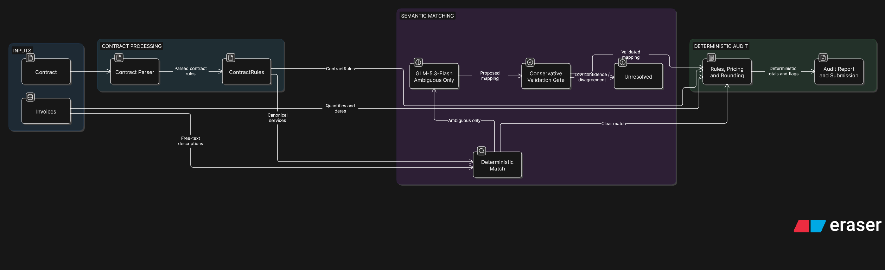

# Invoice Audit Exercise

Meridian Health Assurance Group reimburses five hospitals under five separately
negotiated service contracts. Each hospital submits invoices for the patients
it has treated. Some of those invoices are wrong — a rate that does not match
the contract, an adjustment applied when it was not due or omitted when it was,
a quantity beyond a contractual limit, a service billed twice.

Your job is to find the wrong ones.

## What you have

```
contracts/hospital_1/ ... contracts/hospital_5/
    The five contracts, as Markdown and as plain text. Each hospital's
    contract is presented differently; one of them is split across several
    documents. Read whichever format suits your tooling.

invoices/hospital_N_invoices.csv
    One row per invoice: invoice_id, hospital_id, contract_number,
    invoice_date, patient_id, facility_code, plan_tier, admission_date,
    discharge_date, invoice_total_cents.

invoices/hospital_N_line_items.csv
    One row per line item: line_id, invoice_id, line_no, service_date,
    description, quantity, unit_basis_as_billed, unit_price_cents,
    line_total_cents.

invoices/hospital_N_invoices.jsonl
    The same data, one JSON object per invoice, with the line items nested.
    Use whichever shape you prefer; they carry identical information.

labels/hospital_1_labels.csv
    Ground truth for hospital 1 only — your development set.

submission_template.csv
    The format your predictions must take.
```

All money is an integer number of cents. There are no floating-point amounts
anywhere in the data, and there should be none in your answer.

The line-item `description` is the hospital's own free-text billing
description. It is not a contract term, it is not a code, and the same
contracted service is described many different ways across the data.
Establishing which contracted service a description refers to is part of the
task.

## The task

For hospitals hospital_2, hospital_3, hospital_4, hospital_5, decide for each invoice whether it is erroneous, and
submit your predictions in the format of `submission_template.csv`:

| column | meaning |
|---|---|
| `invoice_id` | the invoice you are making a claim about |
| `flagged` | `1` if you believe the invoice is erroneous, `0` otherwise |
| `error_category` | your own short label for what is wrong; free text |
| `expected_total_cents` | what you believe the invoice *should* have totalled |
| `billed_total_cents` | what it actually totalled |
| `confidence` | your confidence in the row, between 0 and 1 |

Submit a row for every invoice you have an opinion about. Rows for invoices you
believe are correct are useful and are scored.

Hospital 1 is labelled. Use it to develop and to calibrate; it is not scored.

## How this is assessed

**Complete coverage of all five contracts is not expected.** The exercise is
deliberately larger than the time budget. Sequencing — deciding what to attempt
first and what to leave — and reporting honestly on what you did not attempt
are explicitly part of what is being evaluated. A submission covering two
hospitals well, with a clear account of why those two and what would come next,
is a stronger result than a thin pass over all four.

**A confidently wrong extraction is worse than a flagged uncertainty.** If you
tell us a rate is 42.00 and it is not, that error propagates silently into
every invoice touching that service. If you tell us you are unsure, a human
reviews it and the cost is a few minutes. Scoring reflects this: your stated
`confidence` is used, and calibration is measured. Say what you do not know.

## Time budget

Six to eight hours, spread over one week. That is a **cap**, not a target. Do
not exceed it. If you find yourself at the cap with work outstanding, stop and
write down what you would have done next — that write-up is worth more to us
than the extra hours.

## AI assistance

Using AI assistance is permitted and expected. It must be disclosed. Include
your prompts as versioned files in the repository (see deliverables) so we can
see how you worked, not just what you produced.

## Deliverables

1. **A runnable repository.** We should be able to clone it, follow your README,
   and reproduce your submission file. Pin your dependencies.
2. **`submission.csv`** in the template format.
3. **A short evaluation report** giving per-category performance on the
   hospital 1 development set, and an error analysis grouped by *failure type*
   — not a list of individual misses, but the three or four systematic ways
   your approach goes wrong, with an example of each.
4. **Your prompts, as versioned files** in the repository. If you iterated on a
   prompt, we would like to see that it was iterated on.
5. **A one-page decision log**: the assumptions you made, the ambiguities you
   found and could not resolve, and what you decided to do about each. If you
   read a clause two ways and had to pick one, that belongs here.

## Ground rules

- The data is synthetic. There are no real patients and no real hospitals.
- Everything you need is in this package. There is nothing to look up
  externally.
- If something in a contract seems genuinely ambiguous, it may well be. Record
  your reading and move on; do not spend the budget on it.

## Audit flow



Contracts are normalized into validated rules, while invoice descriptions take
a deterministic matching path first. Only ambiguous descriptions reach
`z-ai/glm-5.3-flash`; accepted mappings pass a conservative validation gate
before entering the deterministic pricing engine. Unresolved mappings fail
closed, and all financial calculations and final flags remain in Python.

## Candidate implementation

The implementation is being built in auditable layers. The first layer performs
high-precision structural checks that do not require interpreting free-text
service descriptions. It has no third-party dependencies and runs on Python
3.11 or newer; `requirements.txt` records that dependency decision explicitly.

Run the tests:

```bash
python3 -m unittest discover -s tests -v
```

Run the structural audit and evaluate it on the labelled Hospital 1 development
set:

```bash
python3 -m insurance_auditing structural-audit \
  --hospital 1 \
  --labels labels/hospital_1_labels.csv
```

The command reads the supplied files without changing them and prints a JSON
summary. It deliberately does not produce `submission.csv` yet: contractual
service matching and exact repricing are required before a submission is safe.

Run the full Hospital 1 contract audit and labelled evaluation:

```bash
python3 -m insurance_auditing evaluate-hospital-1
```

This parses the contract tables, normalises abbreviated service descriptions,
applies bundles, premiums, weekend uplifts, cumulative discounts, caps and
exclusions in contract order, and reports invoice-level and per-category
performance. Hospital 1 remains development data and is never written to the
final submission.

Current Hospital 1 development result: all 58 erroneous invoice IDs are found
with no false positives, all labelled error categories are reproduced, and 909
of 913 expected totals match exactly. The four amount differences are all
daily-cap cases where the labels imply an unobserved quantity below the
contractual maximum; the chosen non-overfitting treatment is recorded in
`decision_log.md`. Full per-category metrics and grouped failure analysis are
provided in `evaluation_report.md`.

Prepare the versioned semantic mapping for Hospital 2:

```bash
python3 -m insurance_auditing prepare-hospital-2-mappings
```

This is the only Hospital 2 command that calls an external model. It sends
requests to `z-ai/glm-5.3-flash` through the OpenRouter API provider, groups
ambiguous normalised descriptions, gives the model a bounded contract candidate
set, and requires independent classifier and verifier passes to agree at
confidence 0.90 or higher. Accepted and unresolved decisions are written
atomically to `mappings/hospital_2_service_mappings.json`. Re-running the
command fills only missing entries; pass `--refresh` to re-evaluate existing
entries.

Generate the Hospital 2 audit offline from that reviewed artifact:

```bash
python3 -m insurance_auditing audit-hospital-2
```

The command writes `hospital_2_audit_report.json`. Contract parsing, rule
validation, pricing, rounding and invoice findings are deterministic. The
report includes clause and mapping provenance, and marks each invoice with
`pricing_complete`. An invoice containing any unresolved service has a null
`expected_total_cents` and `difference_cents`; the billed amount is never
silently presented as its expected amount. This preliminary report does not
create or update `submission.csv`.

Generate the preliminary line-level Hospital 4 review report:

```bash
python3 -m insurance_auditing audit-hospital-4 > hospital_4_audit_report.json
```

The report includes only flagged invoice identifiers by default. Pass
`--include-correct` to include all 835 identifiers. Each line records its
service match score, contractual and billed units, rate-calculation steps,
threshold and cumulative quantities, payable quantity, expected total, and
related bundle, exclusion, cap or duplicate lines. The report is explicitly
marked `unlabelled_preliminary_review`; it does not create or update
`submission.csv`. Its summary separates canonical line items from historical
items belonging to earlier occurrences of reused invoice identifiers; those
historical items still participate in cross-invoice calculations.

After reviewing that report, generate or replace the Hospital 4 rows in the
submission file:

```bash
python3 -m insurance_auditing generate-hospital-4-submission \
  --output submission.csv
```

The write is atomic and preserves any existing rows whose invoice identifier
does not start with `INV-H4-`. Confidence is calibrated by ambiguity type as
documented in `decision_log.md`.

## LLM audit agent

An internal, tool-using audit agent is available in `insurance_auditing/agent`.
Other modules can call `run_agent()` and supply the built-in audit tools or
their own `AgentTool` functions. It uses `z-ai/glm-5.3-flash`; OpenRouter is the
configured API transport provider. See `insurance_auditing/agent/README.md` for
usage.

## Future work: reusable and locally deployable

The current OpenRouter integration is an evaluation path, not the intended
long-term hosting architecture. It lets us prove that `z-ai/glm-5.3-flash` is
reliable enough for semantic service matching before deploying the model
locally. The model was selected because it can run without high-cost hardware,
making private, low-cost inference a practical next step.

The hospital-specific workflow can then become a reusable contract-onboarding
pipeline:

1. Parse each new contract into normalized `ContractRules` and validate every
   rule against its source clause.
2. Index canonical services using embeddings and group ambiguous descriptions
   into semantic clusters, allowing one reviewed mapping to resolve many
   repeated line items.
3. Accept a mapping automatically only when the classifier and verifier agree,
   confidence is high, and the evidence points to a valid contract clause.
   Route every other cluster to human review.
4. Fingerprint each contract and invalidate its mappings whenever the source
   terms change.
5. Move semantic inference from OpenRouter to a local
   `z-ai/glm-5.3-flash` deployment once the evaluation criteria are met.

The deployment can change without changing the audit boundary: the model only
interprets ambiguous text. Contract validation, pricing, rounding, totals, and
final audit findings remain deterministic in Python.
